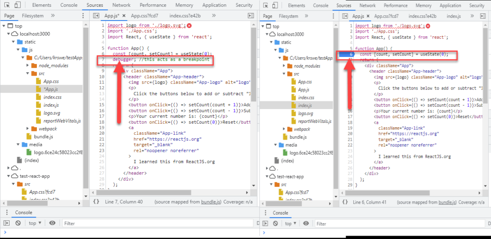
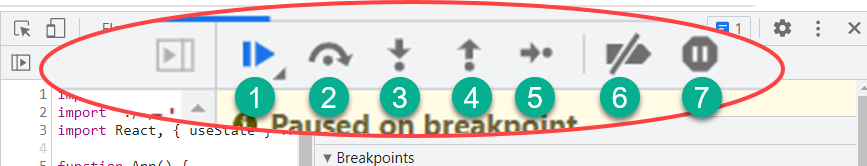
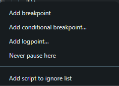
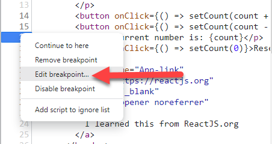
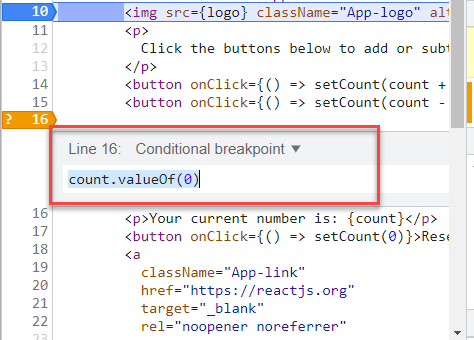
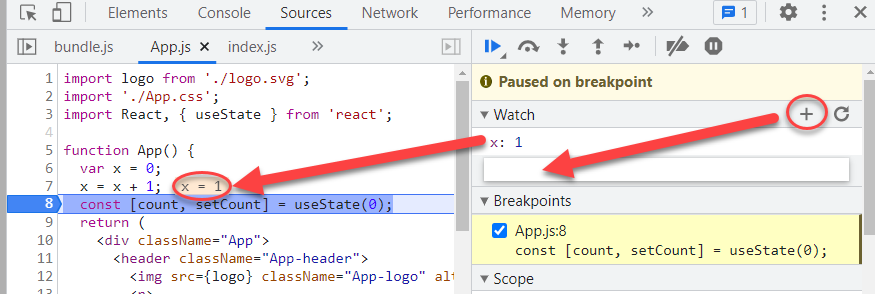

# Devtools source tab
> В программировании то́чка остано́ва (англ. breakpoint) — это преднамеренное прерывание выполнения программы, при котором выполняется вызов отладчика

> Остано́в — вид механического тормозного устройства, предназначенный исключительно для удержания груза при его стремлении к движению.

## Точка остановы через ключевое слово

  

- Слева: использование ключевого слова debugger.
- Справа: использование брейкпоинтов.

## Панель управления точками остановы

  

1. Возобновить выполнение скрипта: продолжить выполнять код до достижения следующей точки останова.
2. Перейти к следующему вызову функции: пропустите вызов функции и перейдите к следующей строке кода.
3. Войти в функцию.
4. Выйти из текущей функции: перейти из текущей функции в логику вызывающей функции.
5. Шаг: Переходим к следующему фрагменту кода.
6. Деактивация точек останова.
7. Останова при возникновении исключений: сейчас в devtools такой кнопки нет.

## Разновидность "точек"

  

## Редактирование точки останова

  

  

## Убийца console.log()

  

